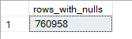
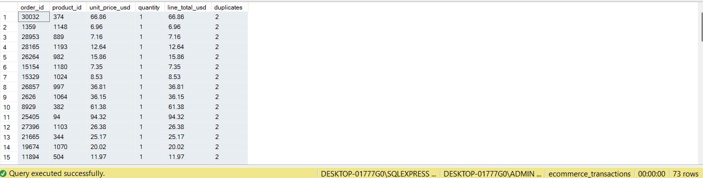

# ShopEase Online E-commerce Transactions and Clickstream Analysis in SQL and Power BI

## 1. Overview
This project analyzes how ShopEase Online, an e-commerce retailer, can leverage customer, transaction, and clickstream data to better understand user behavior and improve business performance. With online shopping becoming increasingly competitive, the company wants to uncover which factors influence how customers browse, engage, and ultimately make purchases.

Through structured SQL analysis and Power BI visualization, this project uncovers actionable insights that help ShopEase Online:

- Identify browsing patterns, conversion bottlenecks, and high-value customer segments

- Optimize marketing channels and promotional strategies

- Understand product performance and factors influencing purchase decisions

- Improve customer engagement, satisfaction, and repeat purchase behavior

By transforming raw clickstream, session, and transaction data into meaningful strategic insights, this project demonstrates how data analytics supports smarter decision-making in modern e-commerce operations.

## 2. Dataset
The dataset contains 7 tables as follows:

- `customers`: customer_id, name, email, country, age, signup_date, marketing_opt_in

- `sessions`: session_id, customer_id, start_time, device, source, country

- `events`: event_id, session_id, timestamp, event_type, product_id, qty, cart_size, payment, discount_pct, amount_usd

- `orders`: order_id, customer_id, order_time, payment_method, discount_pct, subtotal_usd, total_usd, country, device, source

- `order_items`: order_id, product_id, unit_price_usd, quantity, line_total_usd

- `products`: product_id, category, name, price_usd, cost_usd, margin_usd

- `reviews`: review_id, order_id, product_id, rating, review_text, review_time

## 3. Tools

- SQL – Data cleaning, preparation, and answering business questions.

- Power BI – Interactive visualizations and dashboard storytelling.
  
- GitHub – Repository for SQL scripts, documentation, dashboard files, and project write-up.
  
## 4. Data Preparation and Cleaning
Before answering business questions, I performed a thorough data quality assessment across all tables in the e-commerce clickstream dataset. The goal was to ensure accuracy, consistency, and reliability for downstream analytics and modeling.

### 4.1 Handling Missing Values
A NULL-value assessment was conducted on all tables (`customers`, `products`, `sessions`, `orders`, `order_items`, `events`, and `reviews`).

**Findings**

- Only the `events` table contained NULL values (760958 NULL Values).



This is expected in clickstream datasets because different event types generate different attributes.

  **Example:** page_view events do not produce qty, cart_size, or amount_usd, purchase events contain payment and amount information, while browsing events do not.
            
**Actions Taken**

Kept NULL values in the `events` table to preserve the semantic meaning of each event type.
(Replacing NULLs with zeros would distort behavioral patterns.)

### 4.2 Removing Duplicate Records

A duplicate check was performed on all tables using grouping logic.

**Findings**

- Only the `order_items` table contained duplicates.
  
- Identified 73 duplicated line-item pairs, representing 146 duplicated rows.




**Actions Taken**

Duplicates were removed using a ROW_NUMBER () CTE approach to keep exactly one copy of each item:

``` SQL
WITH duplicates_cte AS (
    SELECT *,
           ROW_NUMBER() OVER (
               PARTITION BY order_id, product_id, unit_price_usd, quantity, line_total_usd
               ORDER BY order_id
           ) AS rn
    FROM order_items
)
DELETE FROM duplicates_cte
WHERE rn > 1;
```

## 5. Data Analysis (Answering Business Questions)

## 6. Dashboard in Power BI

## 7. Business Recommendations

## 8. Conclusion
