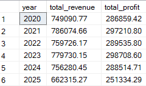
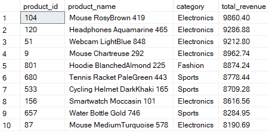
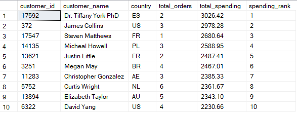
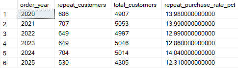
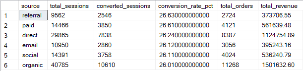
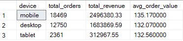
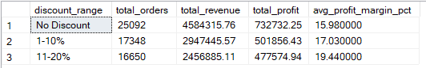
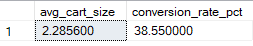
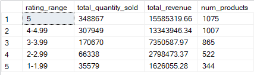
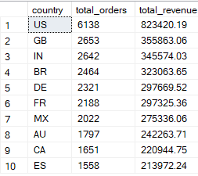

# ShopEase Online E-commerce Transactions and Clickstream Analysis in SQL and Power BI

## 1. Overview
This project analyzes how ShopEase Online, an e-commerce retailer, can leverage customer, transaction, and clickstream data to better understand user behavior and improve business performance. With online shopping becoming increasingly competitive, the company wants to uncover which factors influence how customers browse, engage, and ultimately make purchases.

Through structured SQL analysis and Power BI visualization, this project uncovers actionable insights that help ShopEase Online:

- Identify browsing patterns, conversion bottlenecks, and high-value customer segments

- Optimize marketing channels and promotional strategies

- Understand product performance and factors influencing purchase decisions

- Improve customer engagement, satisfaction, and repeat purchase behavior

By transforming raw clickstream, session, and transaction data into meaningful strategic insights, this project demonstrates how data analytics supports smarter decision-making in modern e-commerce operations.

## 2. Dataset
The dataset contains 7 tables as follows:

- `customers`: customer_id, name, email, country, age, signup_date, marketing_opt_in

- `sessions`: session_id, customer_id, start_time, device, source, country

- `events`: event_id, session_id, timestamp, event_type, product_id, qty, cart_size, payment, discount_pct, amount_usd

- `orders`: order_id, customer_id, order_time, payment_method, discount_pct, subtotal_usd, total_usd, country, device, source

- `order_items`: order_id, product_id, unit_price_usd, quantity, line_total_usd

- `products`: product_id, category, name, price_usd, cost_usd, margin_usd

- `reviews`: review_id, order_id, product_id, rating, review_text, review_time

## 3. Tools

- SQL – Data cleaning, preparation, and answering business questions.

- Power BI – Interactive visualizations and dashboard storytelling.
  
- GitHub – Repository for SQL scripts, documentation, dashboard files, and project write-up.
  
## 4. Data Preparation and Cleaning
Before answering business questions, I performed a thorough data quality assessment across all tables in the e-commerce clickstream dataset. The goal was to ensure accuracy, consistency, and reliability for downstream analytics and modeling.

### 4.1 Handling Missing Values
A NULL-value assessment was conducted on all tables (`customers`, `products`, `sessions`, `orders`, `order_items`, `events`, and `reviews`).

**Findings**

- Only the `events` table contained NULL values (760958 NULL Values).


This is expected in clickstream datasets because different event types generate different attributes.

  **Example:** page_view events do not produce qty, cart_size, or amount_usd, purchase events contain payment and amount information, while browsing events do not.
            
**Actions Taken**

Kept NULL values in the `events` table to preserve the semantic meaning of each event type.
(Replacing NULLs with zeros would distort behavioral patterns.)

### 4.2 Removing Duplicate Records

A duplicate check was performed on all tables using grouping logic.

**Findings**

- Only the `order_items` table contained duplicates.
  
- Identified 73 duplicated line-item pairs, representing 146 duplicated rows.


**Actions Taken**

Duplicates were removed using a ROW_NUMBER () CTE approach to keep exactly one copy of each item:

``` SQL
WITH duplicates_cte AS (
    SELECT *,
           ROW_NUMBER() OVER (
               PARTITION BY order_id, product_id, unit_price_usd, quantity, line_total_usd
               ORDER BY order_id
           ) AS rn
    FROM order_items
)
DELETE FROM duplicates_cte
WHERE rn > 1;
```

## 5. Data Analysis (Answering Business Questions)

I performed structured analysis in Microsoft SQL Management Studio to answer key business questions:

** 1. What is the total revenue and profit per year?**
```sql
WITH revenue_per_year AS (
    SELECT 
        YEAR(order_time) AS year,
        SUM(total_usd) AS total_revenue
    FROM orders
    GROUP BY YEAR(order_time)
),

profit_per_year AS (
    SELECT 
        YEAR(o.order_time) AS year,
        SUM(oi.line_total_usd - (oi.quantity * p.cost_usd)) AS total_profit
    FROM order_items oi
    JOIN orders o 
        ON oi.order_id = o.order_id
    JOIN products p
        ON oi.product_id = p.product_id
    GROUP BY YEAR(o.order_time)
)

SELECT 
    r.year,
    r.total_revenue,
    p.total_profit
FROM revenue_per_year r
JOIN profit_per_year p 
    ON r.year = p.year
ORDER BY r.year;
```


- From 2020 to 2025, ShopEase Online maintained stable revenue and profit levels with slight year-to-year fluctuations, peaking in 2021–2023 before experiencing a moderate decline in 2024–2025.

**2. Which ten products generate the highest revenue?**

```sql
SELECT TOP 10
    p.product_id,
    p.name AS product_name,
    p.category,
    SUM(oi.line_total_usd) AS total_revenue
FROM order_items oi
JOIN products p 
    ON oi.product_id = p.product_id
GROUP BY 
    p.product_id, 
    p.name, 
    p.category
ORDER BY 
    total_revenue DESC;
```


- The top 10 revenue-generating products are dominated by Electronics, with high-performing items like mice, headphones, webcams, and smartwatches, followed by strong contributions from Sports and Fashion categories, each generating between $8,100 and $9,860 in total revenue.

**3. Who are the top 10 customers by total spending and how frequently do they order?**
```sql
SELECT TOP 10
    c.customer_id,
    c.name AS customer_name,
    c.country,
    COUNT(o.order_id) AS total_orders,
    SUM(o.total_usd) AS total_spending,
    RANK() OVER (ORDER BY SUM(o.total_usd) DESC) AS spending_rank
FROM customers c
JOIN orders o
    ON c.customer_id = o.customer_id
GROUP BY 
    c.customer_id, c.name, c.country
ORDER BY spending_rank;
```


- The top 10 highest-spending customers come from diverse countries including Spain, the US, France, Poland, Brazil, and Australia, with total spending ranging from $2,230 to $3,026, showing that high-value customers consistently place multiple orders and drive a significant share of overall revenue.

**4. What percentage of customers make repeat purchases, and how does it change over time?**
```sql
WITH customer_orders AS (
    SELECT 
        customer_id,
        YEAR(order_time) AS order_year,
        COUNT(order_id) AS total_orders
    FROM orders
    GROUP BY customer_id, YEAR(order_time)
),

repeat_flag AS (
    SELECT 
        order_year,
        COUNT(CASE WHEN total_orders > 1 THEN 1 END) AS repeat_customers,
        COUNT(customer_id) AS total_customers
    FROM customer_orders
    GROUP BY order_year
)

SELECT 
    order_year,
    repeat_customers,
    total_customers,
    ROUND((repeat_customers * 1.0 / total_customers) * 100, 2) AS repeat_purchase_rate_pct
FROM repeat_flag
ORDER BY order_year;
```


- Repeat purchase rates remained relatively stable between 12% and 14% from 2020 to 2025, indicating consistent customer retention levels with only minor year-to-year fluctuations.

**5. Which acquisition sources (e.g., ads, organic, email) generate the highest conversion rates and revenue?**

```sql
WITH conversions AS (
    SELECT 
        s.source,
        COUNT(*) AS total_sessions,
        SUM(CASE WHEN o.order_id IS NOT NULL THEN 1 ELSE 0 END) AS converted_sessions
    FROM sessions s
    LEFT JOIN orders o
        ON s.customer_id = o.customer_id
        AND CAST(s.start_time AS DATE) = CAST(o.order_time AS DATE)
    GROUP BY s.source
),

revenues AS (
    SELECT 
        source,
        SUM(total_usd) AS total_revenue,
        COUNT(order_id) AS total_orders
    FROM orders
    GROUP BY source
)

SELECT 
    c.source,
    c.total_sessions,
    c.converted_sessions,
    ROUND((c.converted_sessions * 1.0 / c.total_sessions) * 100, 2) AS conversion_rate_pct,
    r.total_orders,
    r.total_revenue
FROM conversions c
LEFT JOIN revenues r
    ON c.source = r.source
ORDER BY conversion_rate_pct DESC;
```



- Across all acquisition channels, conversion rates remained consistently around 26%, with organic and direct sources generating the highest total revenue and order volume despite similar conversion performance to paid, social, referral, and email sources.

**6. Which devices (mobile, desktop, tablet) contribute most to revenue?**
```sql
SELECT 
    device,
    COUNT(order_id) AS total_orders,
    SUM(total_usd) AS total_revenue,
    ROUND(AVG(total_usd), 2) AS avg_order_value
FROM orders
GROUP BY device
ORDER BY total_revenue DESC;
```



- Mobile devices generated the highest revenue and order volume, followed by desktop and tablet, with all three showing similar average order values around $132–$135.

**7. How do discounts affect total revenue, order volume, and profit margins?**

```sql
SELECT 
    CASE 
        WHEN discount_pct = 0 THEN 'No Discount'
        WHEN discount_pct BETWEEN 0.01 AND 10 THEN '1-10%'
        WHEN discount_pct BETWEEN 10.01 AND 20 THEN '11-20%'
        WHEN discount_pct BETWEEN 20.01 AND 50 THEN '21-50%'
        ELSE '51%+'
    END AS discount_range, -- defining Discount buckets
    
    COUNT(o.order_id) AS total_orders,
    SUM(o.total_usd) AS total_revenue,
    SUM(oi.line_total_usd - (oi.quantity * p.cost_usd)) AS total_profit,
    ROUND(
        CASE WHEN SUM(o.total_usd) = 0 THEN 0
        ELSE SUM(oi.line_total_usd - (oi.quantity * p.cost_usd)) * 1.0 / SUM(o.total_usd) * 100
        END, 2
    ) AS avg_profit_margin_pct

FROM orders o
JOIN order_items oi 
    ON o.order_id = oi.order_id
JOIN products p 
    ON oi.product_id = p.product_id

GROUP BY 
    CASE 
        WHEN discount_pct = 0 THEN 'No Discount'
        WHEN discount_pct BETWEEN 0.01 AND 10 THEN '1-10%'
        WHEN discount_pct BETWEEN 10.01 AND 20 THEN '11-20%'
        WHEN discount_pct BETWEEN 20.01 AND 50 THEN '21-50%'
        ELSE '51%+'
    END

ORDER BY total_revenue DESC;
```



- Orders with no discount generated the highest revenue overall, but moderate discounts (1–20%) delivered higher profit margins—peaking at nearly 19%—showing that strategic discounting can improve profitability while sustaining strong order volumes.

**8. What is the average cart size and conversion rate per session?**

```sql
WITH session_cart AS (
    -- Calculate cart size per session
    SELECT 
        s.session_id,
        s.customer_id,
        s.source,
        s.device,
        SUM(e.qty) AS total_cart_qty
    FROM sessions s
    LEFT JOIN events e
        ON s.session_id = e.session_id
    WHERE e.event_type = 'add_to_cart'  -- only consider add-to-cart events
    GROUP BY s.session_id, s.customer_id, s.source, s.device
),

session_conversion AS (
    -- Flag sessions that resulted in at least one order
    SELECT 
        s.session_id,
        CASE WHEN o.order_id IS NOT NULL THEN 1 ELSE 0 END AS converted
    FROM sessions s
    LEFT JOIN orders o
        ON s.customer_id = o.customer_id
        AND CAST(s.start_time AS DATE) = CAST(o.order_time AS DATE)
)

SELECT 
    AVG(sc.total_cart_qty * 1.0) AS avg_cart_size,
    ROUND(AVG(conv.converted * 1.0) * 100, 2) AS conversion_rate_pct
FROM session_cart sc
JOIN session_conversion conv
    ON sc.session_id = conv.session_id;
```



- ShopEase users added an average of 2.29 items to their cart per session, with a strong overall conversion rate of 38.55%, indicating efficient browsing-to-purchase behavior.

**9. How does product rating affect sales volume and revenue?**

```sql
SELECT 
    CASE 
        WHEN r.rating BETWEEN 1 AND 1.99 THEN '1-1.99'
        WHEN r.rating BETWEEN 2 AND 2.99 THEN '2-2.99'
        WHEN r.rating BETWEEN 3 AND 3.99 THEN '3-3.99'
        WHEN r.rating BETWEEN 4 AND 4.99 THEN '4-4.99'
        ELSE '5'
    END AS rating_range,
    
    SUM(oi.quantity) AS total_quantity_sold,
    SUM(oi.line_total_usd) AS total_revenue,
    COUNT(DISTINCT p.product_id) AS num_products

FROM products p
JOIN order_items oi
    ON p.product_id = oi.product_id
LEFT JOIN reviews r
    ON p.product_id = r.product_id

GROUP BY 
    CASE 
        WHEN r.rating BETWEEN 1 AND 1.99 THEN '1-1.99'
        WHEN r.rating BETWEEN 2 AND 2.99 THEN '2-2.99'
        WHEN r.rating BETWEEN 3 AND 3.99 THEN '3-3.99'
        WHEN r.rating BETWEEN 4 AND 4.99 THEN '4-4.99'
        ELSE '5'
    END
ORDER BY rating_range DESC;
```



- Higher-rated products consistently drove greater sales and revenue, with 5-star items generating the highest volume and revenue, while lower-rated products showed a clear decline in both quantity sold and total earnings.

**10. Which 10 countries generate the highest revenue?**

```sql
SELECT TOP 10
    country,
    COUNT(order_id) AS total_orders,
    SUM(total_usd) AS total_revenue
FROM orders
GROUP BY country
ORDER BY total_revenue DESC;
```



- The United States generated the highest revenue and order volume, followed by the UK, India, Brazil, and major European markets, highlighting strong sales performance across diverse international customer bases.

## 6. Dashboard in Power BI

## 7. Business Recommendations

## 8. Conclusion
